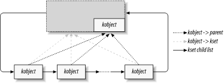

# 14.1 Kobjects、Ksets 和子系统
`kobject` 是将设备模型整合在一起的基础结构。它最初被设计为一个简单的引用计数器，但随着时间的推移，其职责不断增加，字段也越来越多。`struct kobject` 及其支持代码现在处理的任务包括：
- **对象引用计数**：通常，在内核对象创建时，无法确定其存在的时长。跟踪此类对象生命周期的一种方法是通过引用计数。当内核中没有代码持有对某个对象的引用时，该对象的生命周期结束，可以被删除。
- **Sysfs 表示**：每个在 `sysfs` 中显示的对象，其底层都有一个 `kobject` 与内核交互，以创建其可见表示。
- **数据结构粘合**：整个设备模型是一个极其复杂的数据结构，由多个层次结构组成，它们之间有大量的链接。`kobject` 实现并维护了这个结构。
- **热插拔事件处理**：`kobject` 子系统处理事件的生成，这些事件用于通知用户空间系统中硬件的插拔情况。

从上述列表可以推断出，`kobject` 是一个复杂的结构，事实确实如此。不过，通过逐步分析，可以理解这个结构及其工作原理。

## 14.1.1 Kobject 基础
`kobject` 的类型为 `struct kobject`，定义在 `<linux/kobject.h>` 中。该文件还包含了许多与 `kobject` 相关的其他结构的声明，当然，还有一长串用于操作它们的函数。

### 14.1.1.1 嵌入 kobjects
在深入细节之前，有必要花点时间了解 `kobject` 的使用方式。回顾 `kobject` 处理的功能列表，会发现它们都是为其他对象提供的服务。换句话说，`kobject` 本身并没有太大的意义，它只是将一个高层对象与设备模型关联起来。

因此，内核代码很少（甚至几乎不会）创建独立的 `kobject`；相反，`kobject` 用于控制对更大的、特定领域对象的访问。为此，`kobject` 通常嵌入在其他结构中。如果习惯于用面向对象的术语思考，`kobject` 可以看作是一个顶级的抽象类，其他类可以从它派生而来。`kobject` 实现了一组单独使用时不太有用，但在其他对象中却很有价值的功能。C 语言不允许直接表达继承关系，因此必须使用其他技术，例如将一个结构嵌入到另一个结构中。

例如，回顾第 3 章中遇到的 `struct cdev`，在 2.6.10 内核中，该结构如下所示：
```c
struct cdev {
    struct kobject kobj;
    struct module *owner;
    struct file_operations *ops;
    struct list_head list;
    dev_t dev;
    unsigned int count;
};
```
可以看到，`cdev` 结构中嵌入了一个 `kobject`。如果有一个这样的结构，要找到其嵌入的 `kobject`，只需使用 `kobj` 字段。然而，处理 `kobject` 的代码通常会遇到相反的问题：给定一个 `struct kobject` 指针，如何找到包含它的结构的指针？应该避免使用一些技巧（例如假设 `kobject` 位于结构的开头），而是使用 `container_of` 宏（在 3.5.1 节中介绍）。因此，将指向嵌入在 `struct cdev` 中的 `struct kobject` 的指针 `kp` 转换为 `struct cdev` 指针的方法如下：
```c
struct cdev *device = container_of(kp, struct cdev, kobj);
```
程序员通常会定义一个简单的宏，用于将 `kobject` 指针“反向转换”为包含它的类型的指针。

### 14.1.1.2 Kobject 初始化
本书介绍了许多在编译时或运行时可通过简单机制进行初始化的类型。而 kobject 的初始化要复杂一些，尤其是在使用其所有功能时。不过，无论如何使用 kobject，都需要执行几个步骤。

首先，要将整个 kobject 置为 0，通常可通过调用 `memset` 函数来实现。这种初始化操作常常是在对嵌入 kobject 的结构体进行清零操作时一并完成的。若不将 kobject 清零，后续往往会导致一些非常奇怪的崩溃问题，所以这一步不能省略。

下一步是调用 `kobject_init()` 来设置 kobject 的一些内部字段：
```c
void kobject_init(struct kobject *kobj);
```
`kobject_init` 除了完成其他操作外，还会将 kobject 的引用计数设置为 1。不过，仅调用 `kobject_init` 是不够的。使用 kobject 的代码至少要设置 kobject 的名称，这个名称会在 sysfs 条目中使用。如果你查看内核源码，可能会发现有代码直接将字符串复制到 kobject 的 `name` 字段，但应避免这种做法，而应使用以下函数：
```c
int kobject_set_name(struct kobject *kobj, const char *format, ...);
```
该函数接受一个类似于 `printk` 的可变参数列表。信不信由你，这个操作确实有可能失败（因为它可能会尝试分配内存），严谨的代码应该检查返回值并做出相应处理。

创建者还应直接或间接地设置 kobject 的其他字段，即 `ktype`、`kset` 和 `parent`，我们将在本章后面介绍这些内容。

### 14.1.1.3 引用计数操作
kobject 的一个关键功能是为其嵌入的对象充当引用计数器。只要对该对象的引用存在，对象（以及支持它的代码）就必须继续存在。用于操作 kobject 引用计数的底层函数如下：
```c
struct kobject *kobject_get(struct kobject *kobj);
void kobject_put(struct kobject *kobj);
```
成功调用 `kobject_get` 会增加 kobject 的引用计数器，并返回指向该 kobject 的指针。然而，如果 kobject 已经处于销毁过程中，操作将失败，`kobject_get` 会返回 `NULL`。必须始终检查这个返回值，否则可能会导致各种不愉快的竞态条件。

当释放一个引用时，调用 `kobject_put` 会减少引用计数，并且可能会释放该对象。要记住，`kobject_init` 会将引用计数设置为 1，所以在创建 kobject 时，你应该确保在不再需要初始引用时调用相应的 `kobject_put`。

需要注意的是，在很多情况下，kobject 自身的引用计数可能不足以防止竞态条件。例如，kobject（及其包含的结构体）的存在可能依赖于创建它的模块继续存在。在 kobject 还在被使用时卸载该模块是不行的，这就是为什么我们上面看到的 `cdev` 结构体包含一个 `struct module` 指针。`struct cdev` 的引用计数实现如下：
```c
struct kobject *cdev_get(struct cdev *p)
{
    struct module *owner = p->owner;
    struct kobject *kobj;

    if (owner && !try_module_get(owner))
        return NULL;
    kobj = kobject_get(&p->kobj);
    if (!kobj)
        module_put(owner);
    return kobj;
}
```
创建对 `cdev` 结构体的引用时，也需要创建对拥有它的模块的引用。因此，`cdev_get` 使用 `try_module_get` 尝试增加该模块的使用计数。如果该操作成功，再使用 `kobject_get` 增加 kobject 的引用计数。当然，这个操作可能会失败，所以代码会检查 `kobject_get` 的返回值，如果操作失败就释放对模块的引用。 

### 14.1.1.4 释放函数与 kobject 类型
在前面的讨论中，还有一个重要的问题未涉及，即当 kobject 的引用计数达到 0 时会发生什么。创建 kobject 的代码通常并不知道引用计数何时会变为 0；如果知道的话，一开始使用引用计数就没什么意义了。当引入 sysfs 时，即使是可预测的对象生命周期也会变得更加复杂；用户空间程序可以通过保持与其关联的某个 sysfs 文件处于打开状态，在任意长的时间内持有对 kobject 的引用。

最终结果是，由 kobject 保护的结构体不能在驱动程序生命周期内某个单一的、可预测的点被释放，而必须在 kobject 的引用计数变为 0 的任何时刻都有相应的代码来处理释放操作。引用计数并不受创建 kobject 的代码直接控制。因此，每当 kobject 的最后一个引用被释放时，该代码必须被异步通知。

这种通知是通过 kobject 的释放方法来实现的。通常，这种方法的形式如下：
```c
void my_object_release(struct kobject *kobj)
{
    struct my_object *mine = container_of(kobj, struct my_object, kobj);

    /* 对该对象执行任何额外的清理操作，然后... */
    kfree(mine);
}
```
有一点怎么强调都不为过：每个 kobject 都必须有一个释放方法，并且 kobject 必须保持（处于一致状态）直到该方法被调用。如果不满足这些条件，代码就存在缺陷。这可能会导致在对象仍在使用时就将其释放，或者在最后一个引用被归还后未能释放该对象。

有趣的是，释放方法并不存储在 kobject 本身中；相反，它与包含 kobject 的结构体类型相关联。这种类型由 `struct kobj_type` 结构体来跟踪，通常简称为“ktype”。该结构体的定义如下：
```c
struct kobj_type {
    void (*release)(struct kobject *);
    struct sysfs_ops *sysfs_ops;
    struct attribute **default_attrs;
};
```
当然，`struct kobj_type` 中的 `release` 字段是指向该类型 kobject 的释放方法的指针。我们将在本章后面再讨论另外两个字段（`sysfs_ops` 和 `default_attrs`）。

每个 kobject 都需要有一个关联的 `kobj_type` 结构体。令人困惑的是，指向这个结构体的指针可以在两个不同的地方找到。kobject 结构体本身包含一个字段（名为 `ktype`），可以存储这个指针。然而，如果这个 kobject 是某个 kset 的成员，那么 `kobj_type` 指针将由该 kset 提供（我们将在下一节中介绍 kset）。同时，有一个宏：
```c
struct kobj_type *get_ktype(struct kobject *kobj);
```
用于为给定的 kobject 找到 `kobj_type` 指针。 

## 14.1.2 Kobject 层次结构、Ksets 和子系统
`kobject` 结构体常被用于将对象链接成一个层次结构，该结构与所建模的子系统结构相匹配。这种链接有两种不同的机制：父指针和 `ksets`。

`struct kobject` 中的 `parent` 字段是一个指向另一个 `kobject` 的指针，该 `kobject` 代表层次结构中的上一级。例如，如果一个 `kobject` 表示一个 USB 设备，其 `parent` 指针可能指向表示该设备所插入的集线器的对象。

父指针的主要用途是在 `sysfs` 层次结构中定位对象。我们将在 14.2 节中了解其工作原理。

### 14.1.2.1 Ksets
在很多方面，`kset` 看起来像是 `kobj_type` 结构体的扩展；`kset` 是嵌入在相同类型结构体中的 `kobject` 集合。然而，`struct kobj_type` 关注的是对象的类型，而 `struct kset` 关注的是聚合和收集。这两个概念被分开，以便相同类型的对象可以出现在不同的集合中。

因此，`kset` 的主要功能是容纳对象；可以将其视为 `kobject` 的顶级容器类。实际上，每个 `kset` 内部都包含自己的 `kobject`，并且在很多方面，它可以像 `kobject` 一样被处理。值得注意的是，`ksets` 总是会在 `sysfs` 中显示；一旦 `kset` 被设置并添加到系统中，就会为其创建一个 `sysfs` 目录。`kobject` 不一定会在 `sysfs` 中显示，但每个属于 `kset` 的 `kobject` 都会在其中显示。

将 `kobject` 添加到 `kset` 通常在对象创建时进行，这是一个两步的过程。首先，`kobject` 的 `kset` 字段必须指向感兴趣的 `kset`；然后，应将该 `kobject` 传递给以下函数：
```c
int kobject_add(struct kobject *kobj);
```
和往常一样，程序员应该意识到这个函数可能会失败（在这种情况下，它会返回一个负的错误码），并做出相应的响应。内核提供了一个便捷函数：
```c
extern int kobject_register(struct kobject *kobj);
```
这个函数只是 `kobject_init` 和 `kobject_add` 的组合。

当 `kobject` 被传递给 `kobject_add` 时，其引用计数会增加。毕竟，被包含在 `kset` 中也是对该对象的一种引用。在某个时候，可能需要将 `kobject` 从 `kset` 中移除，以清除该引用；这可以通过以下函数完成：
```c
void kobject_del(struct kobject *kobj);
```
还有一个 `kobject_unregister` 函数，它是 `kobject_del` 和 `kobject_put` 的组合。

`kset` 使用标准的内核链表来管理其包含的 `kobject`。几乎在所有情况下，被包含的 `kobject` 在其 `parent` 字段中也有指向该 `kset`（严格来说，是指向其嵌入的 `kobject`）的指针。所以，通常情况下，一个 `kset` 及其包含的 `kobject` 看起来就像图 14 - 1 所示的那样。请记住：
- 图中所有被包含的 `kobject` 实际上都嵌入在其他类型的结构体中，甚至可能是其他 `ksets`。
- 并不要求 `kobject` 的父对象一定是包含它的 `kset`（尽管其他组织方式会很奇怪且罕见）。

图 14 - 2：一个简单的 `kset` 层次结构 


### 14.1.2.2 对 ksets 的操作
在初始化和设置方面，`ksets` 的接口与 `kobjects` 非常相似。存在以下函数：
```c
void kset_init(struct kset *kset);
int kset_add(struct kset *kset);
int kset_register(struct kset *kset);
void kset_unregister(struct kset *kset);
```
在大多数情况下，这些函数只是对 `kset` 中嵌入的 `kobject` 调用类似的 `kobject_` 函数。

对于管理 `ksets` 的引用计数，情况也大致相同：
```c
struct kset *kset_get(struct kset *kset);
void kset_put(struct kset *kset);
```
`kset` 也有一个名称，该名称存储在其嵌入的 `kobject` 中。因此，如果你有一个名为 `my_set` 的 `kset`，可以使用以下方式设置其名称：
```c
kobject_set_name(&my_set->kobj, "The name");
```
`ksets` 在 `ktype` 字段中还有一个指针，指向描述其包含的 `kobjects` 的 `kobj_type` 结构体。这个类型会优先于 `kobject` 自身的 `ktype` 字段被使用。因此，在典型的使用场景中，`struct kobject` 中的 `ktype` 字段通常被置为 `NULL`，因为实际上使用的是 `kset` 中的同名字段。

最后，`kset` 包含一个子系统指针（名为 `subsys`）。现在是时候讨论子系统了。

### 14.1.2.3 子系统
子系统是对内核整体中一个高层部分的表示。子系统通常（但并非总是）出现在 `sysfs` 层次结构的顶部。内核中的一些子系统示例包括 `block_subsys`（`/sys/block`，用于块设备）、`devices_subsys`（`/sys/devices`，核心设备层次结构），以及内核所知的每种总线类型都有一个特定的子系统。驱动程序开发者几乎从不需要创建新的子系统；如果你有这样的想法，请三思。最终你可能想要做的是添加一个新的类，这将在 14.5 节中讨论。

子系统由一个简单的结构体表示：
```c
struct subsystem {
    struct kset kset;
    struct rw_semaphore rwsem;
};
```
因此，子系统实际上只是一个围绕 `kset` 的包装器，并附带了一个信号量。

每个 `kset` 都必须属于一个子系统。子系统成员关系有助于确定 `kset` 在层次结构中的位置，但更重要的是，子系统的 `rwsem` 信号量用于对 `kset` 的内部链表进行串行化访问。这种成员关系通过 `struct kset` 中的 `subsys` 指针来表示。因此，可以从 `kset` 的结构体中找到其所属的子系统，但不能直接从子系统结构体中找到该子系统包含的多个 `ksets`。

子系统通常使用一个特殊的宏来声明：
```c
decl_subsys(name, struct kobj_type *type, 
            struct kset_hotplug_ops *hotplug_ops);
```
这个宏会创建一个 `struct subsystem`，其名称是在传递给宏的名称后面追加 `_subsys` 形成的。该宏还会使用给定的类型和 `hotplug_ops` 来初始化内部的 `kset`。（我们将在本章后面讨论热插拔操作。）

子系统有一系列常见的设置和清理函数：
```c
void subsystem_init(struct subsystem *subsys);
int subsystem_register(struct subsystem *subsys);
void subsystem_unregister(struct subsystem *subsys);
struct subsystem *subsys_get(struct subsystem *subsys);
void subsys_put(struct subsystem *subsys);
```
大多数这些操作只是作用于子系统的 `kset`。 