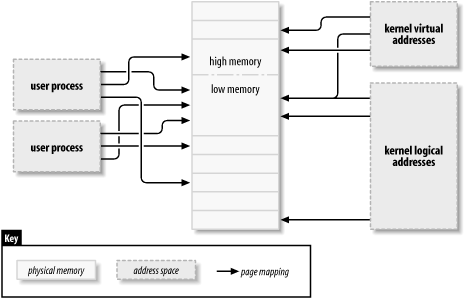

### 15.1 Linux 内存管理
本节并非阐述操作系统内存管理的理论，而是着重介绍 Linux 内存管理实现的主要特性。尽管实现 `mmap` 并不要求你成为 Linux 虚拟内存专家，但对其工作原理有个基本的了解还是很有用的。接下来将详细描述内核用于管理内存的数据结构。在介绍完必要的背景知识后，我们就可以着手使用这些结构了。

#### 15.1.1 地址类型
Linux 当然是一个虚拟内存系统，这意味着用户程序看到的地址并不直接对应硬件使用的物理地址。虚拟内存引入了一层间接映射，带来了许多好处。借助虚拟内存，系统上运行的程序可以分配比实际物理内存更多的内存；实际上，即使单个进程的虚拟地址空间也可以比系统的物理内存大。虚拟内存还允许程序对进程的地址空间进行一些操作，包括将程序内存映射到设备内存。

到目前为止，我们已经提到了虚拟地址和物理地址，但其中一些细节被忽略了。Linux 系统处理几种不同类型的地址，每种地址都有其自身的语义。不幸的是，内核代码在每种情况下并不总是很清楚具体使用的是哪种类型的地址，因此程序员必须小心。

以下是 Linux 中使用的地址类型列表。图 15 - 1 展示了这些地址类型与物理内存的关系。
- **用户虚拟地址**：这是用户空间程序看到的常规地址。根据底层硬件架构的不同，用户地址长度为 32 位或 64 位，每个进程都有自己的虚拟地址空间。
- **物理地址**：处理器与系统内存之间使用的地址。物理地址为 32 位或 64 位；即使是 32 位系统，在某些情况下也可以使用更大的物理地址。
- **总线地址**：外围总线与内存之间使用的地址。通常，它们与处理器使用的物理地址相同，但不一定总是如此。一些架构可以提供一个 I/O 内存管理单元（IOMMU），用于在总线和主内存之间重新映射地址。IOMMU 在很多方面可以简化工作（例如，使分散在内存中的缓冲区对设备来说看起来是连续的），但在设置 DMA 操作时，对 IOMMU 进行编程是必须额外执行的步骤。总线地址当然高度依赖于架构。
- **内核逻辑地址**：这些构成了内核的正常地址空间。这些地址映射主内存的一部分（也许是全部），并且通常被当作物理地址来处理。在大多数架构中，逻辑地址及其相关的物理地址仅相差一个常量偏移量。逻辑地址使用硬件的原生指针大小，因此在配备大量内存的 32 位系统中，可能无法寻址所有的物理内存。逻辑地址通常存储在 `unsigned long` 或 `void *` 类型的变量中。`kmalloc` 返回的内存具有内核逻辑地址。
- **内核虚拟地址**：内核虚拟地址与逻辑地址类似，它们都是从内核空间地址到物理地址的映射。然而，内核虚拟地址不一定具有逻辑地址空间那种线性的、一对一的物理地址映射。所有逻辑地址都是内核虚拟地址，但许多内核虚拟地址不是逻辑地址。例如，`vmalloc` 分配的内存具有虚拟地址（但没有直接的物理映射）。`kmap` 函数（本章后面会介绍）也返回虚拟地址。虚拟地址通常存储在指针变量中。


图 15 - 1. Linux中使用的地址类型


如果你有一个逻辑地址，`__pa()` 宏（在 `<asm/page.h>` 中定义）会返回其相关的物理地址。物理地址可以通过 `__va()` 映射回逻辑地址，但仅适用于低内存页面。

不同的内核函数需要不同类型的地址。如果能定义不同的 C 类型，使所需的地址类型明确就好了，但我们没那么幸运。在本章中，我们会尽量明确在哪些地方使用哪种类型的地址。

#### 15.1.2 物理地址与页面
物理内存被划分为称为页面的离散单元。系统对内存的许多内部处理都是按页面进行的。页面大小因架构而异，不过目前大多数系统使用 4096 字节的页面。常量 `PAGE_SIZE`（在 `<asm/page.h>` 中定义）给出了任何给定架构上的页面大小。

如果你查看一个内存地址（虚拟或物理），它可以被划分为页号和页内偏移量。例如，如果使用 4096 字节的页面，最低 12 位是偏移量，其余较高位表示页号。如果你丢弃偏移量并将其余部分右移，结果称为页框号（PFN）。移位操作以在页框号和地址之间进行转换是相当常见的操作；`PAGE_SHIFT` 宏表示为了进行这种转换必须移位的位数。

#### 15.1.3 高端内存与低端内存
逻辑地址和内核虚拟地址之间的差异在配备大量内存的 32 位系统中尤为突出。32 位地址可以寻址 4GB 的内存。然而，直到最近，32 位系统上的 Linux 由于其设置虚拟地址空间的方式，所能管理的内存仍远低于此。

内核（在 x86 架构的默认配置下）将 4GB 的虚拟地址空间在用户空间和内核之间进行划分；在两种上下文中使用相同的映射集。典型的划分是为用户空间分配 3GB，为内核空间分配 1GB。内核的代码和数据结构必须位于该空间内，但内核地址空间的最大消耗者是物理内存的虚拟映射。换句话说，内核需要自己的虚拟地址来直接操作任何它必须触及的内存。因此，多年来，内核能够处理的最大物理内存量是能够映射到内核虚拟地址空间部分的内存量，减去内核代码本身所需的空间。结果，基于 x86 的 Linux 系统最多只能处理略低于 1GB 的物理内存。

[1] 许多非 x86 架构能够有效地避免这里描述的内核/用户空间划分，因此在 32 位系统上它们可以使用高达 4GB 的内核地址空间。然而，当安装的内存超过 4GB 时，本节中描述的限制仍然适用于这些系统。

为了响应商业上对支持更多内存同时不破坏 32 位应用程序和系统兼容性的压力，处理器制造商在其产品中添加了“地址扩展”功能。结果是，在许多情况下，即使是 32 位处理器也可以寻址超过 4GB 的物理内存。然而，通过逻辑地址能够直接映射的内存量仍然有限。只有最低部分的内存（根据硬件和内核配置，最多 1GB 或 2GB）具有逻辑地址；其余（高端内存）则没有。在内核访问特定的高端内存页面之前，必须设置一个显式的虚拟映射，以使该页面在内核地址空间中可用。因此，许多内核数据结构必须放置在低端内存中；高端内存往往保留给用户空间进程页面。

[2] 2.6 内核（添加补丁后）可以在 x86 硬件上支持“4G/4G”模式，这使得内核和用户虚拟地址空间更大，但会有一定的性能代价。

“高端内存”这个术语可能会让一些人感到困惑，特别是因为它在 PC 领域还有其他含义。为了明确概念，我们在这里定义这些术语：
- **低端内存**：在内核空间中有逻辑地址的内存。在几乎所有你可能遇到的系统中，所有内存都是低端内存。
- **高端内存**：由于超出了为内核虚拟地址预留的地址范围，而没有逻辑地址的内存。

在 i386 系统上，低端内存和高端内存之间的边界通常设置在略低于 1GB 的位置，不过这个边界可以在内核配置时更改。这个边界与原始 PC 上的 640KB 限制毫无关系，其位置也不是由硬件决定的。相反，它是内核在将 32 位地址空间在用户空间和内核之间划分时自身设置的限制。

在本章中，当涉及到高端内存的使用限制时，我们会指出这些限制。

#### 15.1.4 内存映射与 `struct page`
从历史上看，内核使用逻辑地址来引用物理内存页面。然而，高端内存支持的引入暴露了这种方法的一个明显问题——高端内存没有逻辑地址。因此，处理内存的内核函数越来越多地使用指向 `struct page`（在 `<linux/mm.h>` 中定义）的指针。这个数据结构用于跟踪内核关于物理内存所需了解的几乎所有信息；系统上的每个物理页面都有一个 `struct page`。该结构的一些字段包括：
- `atomic_t count;`：对该页面的引用数量。当计数降为 0 时，该页面将被返回给空闲列表。
- `void *virtual;`：如果页面已映射，则为该页面的内核虚拟地址；否则为 `NULL`。低端内存页面总是被映射；高端内存页面通常不会。这个字段并非在所有架构上都存在；通常仅在无法轻松计算页面内核虚拟地址的地方编译。如果你想查看这个字段，正确的方法是使用下面描述的 `page_address` 宏。
- `unsigned long flags;`：一组描述页面状态的位标志。其中包括 `PG_locked`，表示页面已在内存中锁定；以及 `PG_reserved`，可防止内存管理系统对该页面进行任何操作。

`struct page` 中还有更多信息，但这属于内存管理更深层次的内容，通常与驱动程序编写者无关。

内核维护一个或多个 `struct page` 条目的数组，用于跟踪系统上的所有物理内存。在一些系统中，有一个名为 `mem_map` 的单个数组。然而，在某些系统中，情况更为复杂。非均匀内存访问（NUMA）系统以及具有广泛不连续物理内存的系统可能有多个内存映射数组，因此为了可移植性，代码应尽可能避免直接访问该数组。幸运的是，通常只需要处理 `struct page` 指针，而不必担心它们来自何处。

定义了一些函数和宏用于在 `struct page` 指针和虚拟地址之间进行转换：
- `struct page *virt_to_page(void *kaddr);`：这个宏在 `<asm/page.h>` 中定义，接受一个内核逻辑地址并返回其相关的 `struct page` 指针。由于它需要一个逻辑地址，因此不适用于 `vmalloc` 分配的内存或高端内存。
- `struct page *pfn_to_page(int pfn);`：返回给定页框号对应的 `struct page` 指针。如有必要，它会在将页框号传递给 `pfn_to_page` 之前使用 `pfn_valid` 检查其有效性。
- `void *page_address(struct page *page);`：如果该页面存在内核虚拟地址，则返回该地址。对于高端内存，只有在页面已映射的情况下才有该地址。此函数在 `<linux/mm.h>` 中定义。在大多数情况下，你可能更希望使用 `kmap` 的某个版本而不是 `page_address`。

```c
#include <linux/highmem.h>
void *kmap(struct page *page);
void kunmap(struct page *page);
```
`kmap` 为系统中的任何页面返回一个内核虚拟地址。对于低端内存页面，它只返回页面的逻辑地址；对于高端内存页面，`kmap` 在内核地址空间的一个专用部分创建一个特殊映射。使用 `kmap` 创建的映射应始终使用 `kunmap` 释放；此类映射的数量有限，因此最好不要长时间持有它们。`kmap` 调用会维护一个计数器，因此如果两个或多个函数都对同一页面调用 `kmap`，会得到正确的结果。还要注意，如果没有可用的映射，`kmap` 可能会睡眠。

```c
#include <linux/highmem.h>
#include <asm/kmap_types.h>
void *kmap_atomic(struct page *page, enum km_type type);
void kunmap_atomic(void *addr, enum km_type type);
```
`kmap_atomic` 是 `kmap` 的高性能版本。每个架构都为原子 `kmap` 维护一个小的槽位列表（专用页表项）；`kmap_atomic` 的调用者必须在 `type` 参数中告诉系统使用哪个槽位。对于驱动程序有意义的唯一槽位是 `KM_USER0` 和 `KM_USER1`（用于直接从用户空间调用运行的代码），以及 `KM_IRQ0` 和 `KM_IRQ1`（用于中断处理程序）。请注意，原子 `kmap` 必须以原子方式处理；持有原子 `kmap` 时，你的代码不能睡眠。还要注意，内核中没有机制阻止两个函数尝试使用相同的槽位并相互干扰（尽管每个 CPU 都有一组唯一的槽位）。实际上，原子 `kmap` 槽位的争用似乎不是问题。

在本章及后续章节的示例代码中，我们会看到这些函数的一些用法。

#### 15.1.5 页表
在任何现代系统中，处理器必须有一种机制将虚拟地址转换为相应的物理地址。这种机制称为页表；它本质上是一个多级树状结构数组，包含虚拟到物理的映射以及一些相关标志。即使在不直接使用此类表的架构上，Linux 内核也会维护一组页表。

设备驱动程序通常执行的许多操作都可能涉及操作页表。幸运的是，对于驱动程序编写者来说，2.6 内核已经消除了直接处理页表的任何需求。因此，我们不会详细描述它们；好奇的读者可以参考 Daniel P. Bovet 和 Marco Cesati 所著的《Understanding The Linux Kernel》（O'Reilly 出版）以了解全部内容。

#### 15.1.6 虚拟内存区域
虚拟内存区域（VMA）是内核用于管理进程地址空间中不同区域的数据结构。VMA 表示进程虚拟内存中的一个同质区域：具有相同权限标志且由相同对象（例如文件或交换空间）支持的连续虚拟地址范围。它大致对应于“段”的概念，不过更好的描述是“具有自身属性的内存对象”。进程的内存映射至少由以下区域组成：
- 程序可执行代码的区域（通常称为文本段）
- 多个数据区域，包括已初始化数据（在执行开始时具有显式赋值的值）、未初始化数据（BSS）[3] 以及程序栈
[3] “BSS”这个名称源于一个古老的汇编操作符，意思是“由符号开始的块”。可执行文件的 BSS 段不存储在磁盘上，内核将零页映射到 BSS 地址范围。
- 每个活动内存映射的一个区域

进程的内存区域可以通过查看 `/proc/<pid>/maps`（其中 `pid` 当然要替换为进程 ID）来查看。`/proc/self` 是 `/proc/pid` 的一个特殊情况，因为它始终指当前进程。例如，以下是几个内存映射（我们添加了斜体的简短注释）：

```plaintext
# cat /proc/1/maps     查看 init 进程
08048000 - 0804e000 r - xp 00000000 03:01 64652      /sbin/init   文本段
0804e000 - 0804f000 rw - p 00006000 03:01 64652      /sbin/init   数据段
0804f000 - 08053000 rwxp 00000000 00:00 0           零映射的 BSS 段
40000000 - 40015000 r - xp 00000000 03:01 96278      /lib/ld - 2.3.2.so   文本段
40015000 - 40016000 rw - p 0014000 03:01 96278      /lib/ld - 2.3.2.so   数据段
40016000 - 40017000 rw - p 00000000 00:00 0           ld.so 的 BSS 段
42000000 - 4212e000 r - xp 00000000 03:01 80290      /lib/tls/libc - 2.3.2.so   文本段
4212e000 - 42131000 rw - p 0012e000 03:01 80290      /lib/tls/libc - 2.3.2.so   数据段
42131000 - 42133000 rw - p 00000000 00:00 0           libc 的 BSS 段
bffff000 - c0000000 rwxp 00000000 00:00 0           栈段
ffffe000 - fffff000 ---p 00000000 00:00 0           vsyscall 页

# rsh wolf cat /proc/self/maps  #### x86 - 64（已修剪）
00400000 - 00405000 r - xp 00000000 03:01 1596291     /bin/cat     文本段
00504000 - 00505000 rw - p 00004000 03:01 1596291     /bin/cat     数据段