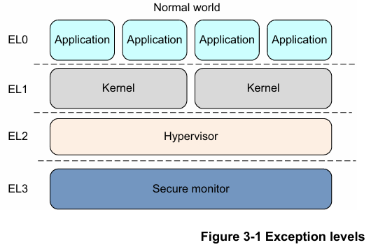
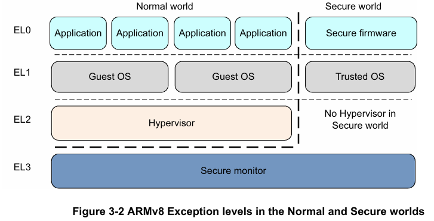
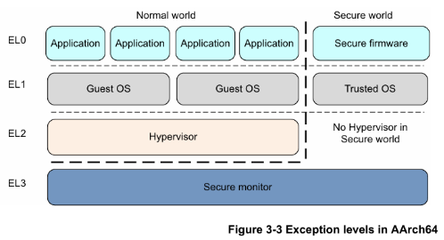
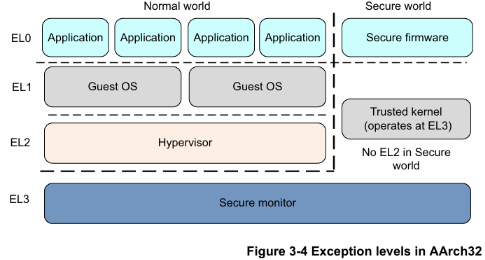
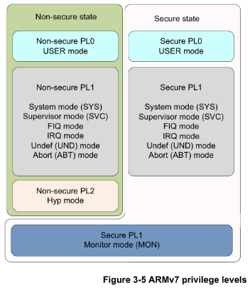
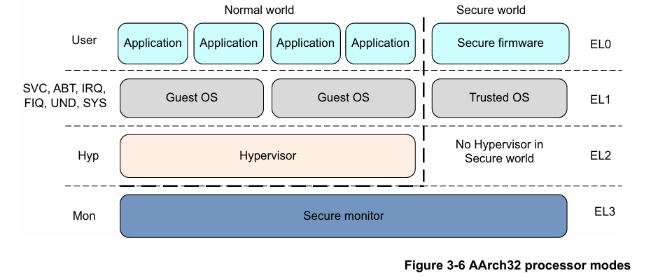
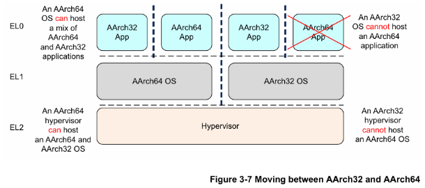

### 第三章

### ARMv8基础

在ARMv8中，执行发生在四个异常级别之一。在AArch64中，异常级别决定了特权级别，类似于ARMv7中定义的特权级别。异常级别决定了特权级别，因此在ELn执行对应于特权级别PLn。同样，具有较大n值的异常级别比另一个异常级别更高。具有较小数字的异常级别被描述为处于较低的异常级别。

异常级别提供了软件执行特权的逻辑分离，适用于ARMv8架构的所有操作状态。它类似于并支持计算机科学中常见的分层保护域的概念。

以下是每个异常级别运行的软件的典型示例：

EL0 普通用户应用程序。

EL1 操作系统内核，通常描述为特权。

EL2 虚拟机监视器（Hypervisor）。

EL3 低级固件，包括安全监视器。

图3-1异常级别

通常，一个软件，如应用程序、操作系统内核或虚拟机监视器，占据一个异常级别。一个例外是内核中的虚拟机监视器，如KVM，它在EL2和EL1之间操作。

ARMv8-A提供了两种安全状态，安全和非安全。非安全状态也被称为普通世界。这使得操作系统（OS）可以与受信任的操作系统在同一硬件上并行运行，并提供对某些软件攻击和硬件攻击的保护。ARM TrustZone技术使系统能够在普通世界和安全世界之间进行分区。与ARMv7-A架构一样，安全监视器充当在普通世界和安全世界之间移动的网关。

图3-2ARMv8在普通世界和安全世界中的异常级别

ARMv8-A还支持虚拟化，但仅在普通世界中。这意味着虚拟机监视器（VMM）代码可以在系统上运行并托管多个客户操作系统。每个客户操作系统基本上都在虚拟机上运行。每个操作系统都不知道它与其他客户操作系统共享系统时间。

普通世界（对应于非安全状态）具有以下特权组件：

### 客户操作系统内核

这些内核包括在非安全EL1中运行的Linux或Windows。在虚拟机监视器下运行时，丰富的操作系统内核可以作为客户或主机运行，具体取决于虚拟机监视器模型。

### 虚拟机监视器

它在EL2运行，始终是非安全的。当存在并启用时，虚拟机监视器为丰富的操作系统内核提供虚拟化服务。

安全世界具有以下特权组件：

### 安全固件

在应用处理器上，此固件必须是启动时首先运行的东西。它提供了多种服务，包括平台初始化、受信任操作系统的安装和安全监视器调用的路由。

### 受信任的操作系统

受信任的操作系统为普通世界提供安全服务，并为执行安全或受信任的应用程序提供运行时环境。

ARMv8架构中的安全监视器处于更高的异常级别，并且比所有其他级别更具特权。这提供了软件特权的逻辑模型。

图3-2在第3-2页显示，EL2的安全版本不可用。

### 3.1 执行状态

ARMv8架构定义了两个执行状态，AArch64和AArch32。每个状态分别用于描述使用64位宽通用寄存器或32位宽通用寄存器的执行。虽然ARMv8 AArch32保留了ARMv7的特权定义，但在AArch64中，特权级别由异常级别决定。因此，在ELn执行对应于特权级别PLn。

在AArch64状态下，处理器执行A64指令集。在AArch32状态下，处理器可以执行A32（在早期版本的架构中称为ARM）或T32（Thumb）指令集。

以下图表显示了AArch64和AArch32中异常级别的组织。

在AArch64中：

图3-3AArch64中的异常级别

在AArch32中：

图3-4AArch32中的异常级别

在AArch32状态下，受信任的操作系统软件在安全EL3中执行，而在AArch64状态下，它主要在安全EL1中执行。

### 3.2 更改异常级别

在ARMv7架构中，处理器模式可以在特权软件控制下更改，或者在发生异常时自动更改。当发生异常时，核心保存当前执行状态和返回地址，进入所需模式，并可能禁用硬件中断。

下表总结了这一点。应用程序在最低特权级别PL0（以前称为非特权模式）下运行。操作系统在PL1下运行，具有虚拟化扩展的系统中的虚拟机监视器在PL2下运行。安全监视器，作为在安全和非安全（普通）世界之间移动的网关，也在PL1下运行。

表3-1 ARMv7处理器模式

| 模式 | 功能 | 安全状态 | 特权级别 |
| --- | --- | --- | --- |
| 用户（USR） | 大多数应用程序运行的非特权模式 | 两者 | PL0 |
| FIQ | 在FIQ中断异常时进入 | 两者 | PL1 |
| IRQ | 在IRQ中断异常时进入 | 两者 | PL1 |
| 超级用户（SVC） | 在复位或执行超级用户调用指令（SVC）时进入 | 两者 | PL1 |
| 监视器（MON） | 在执行SMC指令（安全监视器调用）或处理器采取配置为安全处理的异常时进入。用于支持在安全和非安全状态之间切换。 | 仅安全 | PL1 |
| 中止（ABT） | 在内存访问异常时进入 | 两者 | PL1 |
| 未定义（UND） | 在执行未定义指令时进入 | 两者 | PL1 |
| 系统（SYS） | 特权模式，与用户模式共享寄存器视图 | 两者 | PL1 |
| 虚拟机（HYP） | 通过虚拟机调用和虚拟机陷阱异常进入。 | 仅非安全 | PL2 |

图3-5ARMv7特权级别

在AArch64中，处理器模式映射到异常级别，如图3-6所示。与ARMv7（AArch32）一样，当发生异常时，处理器更改为支持异常处理的异常级别（模式）。

图3-6AArch32处理器模式

异常级别之间的移动遵循以下规则：

移动到更高的异常级别，例如从EL0到EL1，表示软件执行特权的增加。

异常不能被带到更低的异常级别。

在EL0级别没有异常处理，异常必须在更高的异常级别处理。

异常导致程序流的改变。异常处理程序的执行从与所采取的异常相关的定义向量开始，在比EL0更高的异常级别。异常包括：

中断，如IRQ和FIQ。

内存系统中止。

未定义指令。

系统调用。这些允许非特权软件向操作系统进行系统调用。

安全监视器或虚拟机监视器陷阱。

通过执行ERET指令结束异常处理并返回到先前的异常级别。

从异常返回可以保持在相同的异常级别或进入更低的异常级别。它不能移动到更高的异常级别。

安全状态不会随着异常级别的改变而改变，除非从EL3返回到非安全状态。参见第17-8页在安全和非安全状态之间切换。

### 3.3 更改执行状态

有时必须更改系统的执行状态。例如，如果正在运行64位操作系统，并希望在EL0运行32位应用程序。为此，系统必须更改为AArch32。

当应用程序完成或执行返回到操作系统时，系统可以切换回AArch64。图3-7在第3-9页显示，不能反过来做。AArch32操作系统不能托管64位应用程序。

要在相同异常级别之间更改执行状态，必须切换到更高的异常级别，然后返回到原始异常级别。例如，可能在64位操作系统下运行32位和64位应用程序。在这种情况下，32位应用程序可以执行并生成超级用户调用（SVC）指令，或接收中断，导致切换到EL1和AArch64。（参见第6-21页的异常处理指令。）操作系统然后可以进行任务切换并返回到AArch64的EL0。实际上，这意味着不能有混合的32位和64位应用程序，因为没有直接的方式在它们之间调用。

只能通过更改异常级别来更改执行状态。采取异常可能会从AArch32更改为AArch64，而从异常返回可能会从AArch64更改为AArch32。

EL3的代码不能采取异常到更高的异常级别，因此不能更改执行状态，除非通过重置。

以下是在AArch64和AArch32执行状态之间更改时的一些要点总结：

AArch64和AArch32执行状态具有通常相似的异常级别，但在安全和非安全操作之间存在一些差异。生成异常时处理器所处的执行状态可能会限制另一个执行状态可用的异常级别。

更改为AArch32需要从更高的异常级别到更低的异常级别。这是通过执行ERET指令退出异常处理程序的结果。参见第6-21页的异常处理指令。

更改为AArch64需要从更低的异常级别到更高的异常级别。异常可能是指令执行或外部信号的结果。

如果在采取异常或从异常返回时，异常级别保持不变，则执行状态不能更改。

在ARMv8处理器在特定异常级别以AArch32执行状态操作的情况下，它使用与ARMv7相同的异常模型来处理到该异常级别的异常。在AArch64执行状态中，它使用第10章AArch64异常处理中描述的异常处理模型。

因此，两种状态之间的互操作在安全监视器、虚拟机监视器或操作系统级别进行。在AArch64状态下执行的虚拟机监视器或操作系统可以支持较低特权级别的AArch32操作。这意味着在AArch64下运行的操作系统可以托管AArch32和AArch64应用程序。同样，AArch64虚拟机监视器可以托管AArch32和AArch64客户操作系统。然而，32位操作系统不能托管64位应用程序，32位虚拟机监视器不能托管64位客户操作系统。

图3-7在AArch32和AArch64之间移动

对于最高实现的异常级别（在Cortex-A53和Cortex-A57处理器上的EL3），在采取异常时为每个异常级别使用的执行状态是固定的。异常级别只能通过重置处理器来更改。对于EL2和EL1，它由第4-7页的系统寄存器控制。