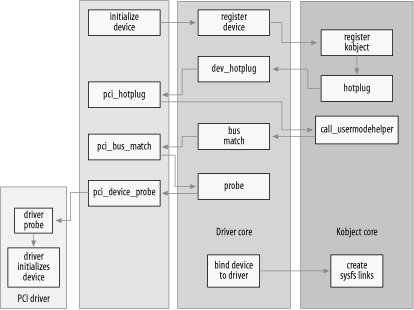

### 14.6. 整合起来
为了更好地理解驱动模型的工作原理，让我们梳理一下设备在内核中的生命周期步骤。我们将描述PCI子系统如何与驱动模型交互，驱动程序添加和移除的基本概念，以及设备如何添加到系统和从系统中移除。这些细节虽然具体描述的是PCI内核代码，但也适用于所有其他使用驱动程序核心来管理其驱动程序和设备的子系统。

PCI核心、驱动程序核心与各个PCI驱动程序之间的交互非常复杂，如图14-2所示。


### 14.6.1. 添加设备
PCI子系统声明了一个名为`pci_bus_type`的`struct bus_type`结构体，并使用以下值进行初始化：
```c
struct bus_type pci_bus_type = {
   .name      = "pci",
   .match     = pci_bus_match,
   .hotplug   = pci_hotplug,
   .suspend   = pci_device_suspend,
   .resume    = pci_device_resume,
   .dev_attrs = pci_dev_attrs,
};
```
当PCI子系统在内核中加载时，这个`pci_bus_type`变量会通过调用`bus_register`向驱动程序核心注册。此时，驱动程序核心会在`/sys/bus/pci`目录下创建一个sysfs目录，该目录包含两个子目录：`devices`和`drivers`。

所有PCI驱动程序都必须定义一个`struct pci_driver`变量，该变量定义了此PCI驱动程序能够执行的不同功能（有关PCI子系统以及如何编写PCI驱动程序的更多信息，请参见第12章）。这个结构体包含一个`struct device_driver`，当PCI驱动程序注册时，由PCI核心对其进行初始化：
```c
// 初始化通用驱动程序字段
drv->driver.name = drv->name;
drv->driver.bus = &pci_bus_type;
drv->driver.probe = pci_device_probe;
drv->driver.remove = pci_device_remove;
drv->driver.kobj.ktype = &pci_driver_kobj_type;
```
这段代码将驱动程序的总线设置为指向`pci_bus_type`，并将探测（probe）和移除（remove）函数指向PCI核心中的相应函数。驱动程序的`kobject`的`ktype`设置为变量`pci_driver_kobj_type`，以便PCI驱动程序的属性文件能够正常工作。然后，PCI核心向驱动程序核心注册PCI驱动程序：
```c
// 向核心注册
error = driver_register(&drv->driver);
```
此时，该驱动程序已准备好与它支持的任何PCI设备绑定。

PCI核心在与PCI总线实际通信的特定架构代码的帮助下，开始探测PCI地址空间，查找所有PCI设备。找到PCI设备后，PCI核心会在内存中创建一个`struct pci_dev`类型的新变量。`struct pci_dev`结构体的部分内容如下：
```c
struct pci_dev {
    /* ... */
    unsigned int   devfn;
    unsigned short vendor;
    unsigned short device;
    unsigned short subsystem_vendor;
    unsigned short subsystem_device;
    unsigned int   class;
    /* ... */
    struct pci_driver *driver;
    /* ... */
    struct device dev;
    /* ... */
};
```
这个PCI设备的特定总线字段由PCI核心初始化（如`devfn`、`vendor`、`device`等字段），并且`struct device`变量的`parent`变量会设置为该PCI设备所在的PCI总线设备。`bus`变量设置为指向`pci_bus_type`结构体。然后，根据从PCI设备读取的名称和ID来设置`name`和`bus_id`变量。

在初始化PCI设备结构体之后，通过调用以下函数向驱动程序核心注册该设备：
```c
device_register(&dev->dev);
```
在`device_register`函数内部，驱动程序核心会初始化设备的多个字段，向`kobject`核心注册设备的`kobject`（这会生成一个热插拔事件，我们将在本章后面讨论），然后将该设备添加到设备父节点持有的设备列表中。这样做是为了能够按正确顺序遍历所有设备，始终明确每个设备在设备层级结构中的位置。

然后，该设备会被添加到特定总线的所有设备列表中，在这个例子中是`pci_bus_type`列表。接着，遍历向该总线注册的所有驱动程序列表，并为每个驱动程序调用总线的匹配函数，传入这个设备。对于`pci_bus_type`总线，在设备提交给驱动程序核心之前，PCI核心已将匹配函数设置为指向`pci_bus_match`函数。

`pci_bus_match`函数将驱动程序核心传递给它的`struct device`强制转换回`struct pci_dev`，同时也将`struct device_driver`强制转换回`struct pci_driver`，然后查看设备和驱动程序的PCI设备特定信息，判断该驱动程序是否声明能够支持这种设备。如果匹配不成功，该函数向驱动程序核心返回0，驱动程序核心则继续检查列表中的下一个驱动程序。

如果匹配成功，该函数向驱动程序核心返回1。这会使驱动程序核心将`struct device`中的`driver`指针指向这个驱动程序，然后调用`struct device_driver`中指定的探测函数。

之前，在PCI驱动程序向驱动程序核心注册之前，`probe`变量已被设置为指向`pci_device_probe`函数。这个函数再次将`struct device`强制转换回`struct pci_dev`，并将设备中设置的`struct driver`强制转换回`struct pci_driver`。它再次验证该驱动程序声明能够支持这个设备（不知为何，这似乎是一个多余的额外检查），增加设备的引用计数，然后使用指向它应绑定的`struct pci_dev`结构体的指针调用PCI驱动程序的探测函数。

如果PCI驱动程序的探测函数确定由于某种原因它无法处理这个设备，就会返回一个负的错误值，该值会传播回驱动程序核心，导致驱动程序核心继续在驱动程序列表中查找与该设备匹配的驱动程序。如果探测函数能够认领该设备，它会进行处理该设备所需的所有初始化操作，然后向驱动程序核心返回0。这会使驱动程序核心将该设备添加到当前由这个特定驱动程序绑定的所有设备列表中，并在sysfs中驱动程序目录内创建一个指向它现在控制的设备的符号链接。通过这个符号链接，用户可以清楚地看到哪些设备与哪些驱动程序绑定。例如：
```bash
$ tree /sys/bus/pci
/sys/bus/pci/
|-- devices
|   |-- 0000:00:00.0 -> ../../../devices/pci0000:00/0000:00:00.0
|   |-- 0000:00:00.1 -> ../../../devices/pci0000:00/0000:00:00.1
|   |-- 0000:00:00.2 -> ../../../devices/pci0000:00/0000:00:00.2
|   |-- 0000:00:02.0 -> ../../../devices/pci0000:00/0000:00:02.0
|   |-- 0000:00:04.0 -> ../../../devices/pci0000:00/0000:00:04.0
|   |-- 0000:00:06.0 -> ../../../devices/pci0000:00/0000:00:06.0
|   |-- 0000:00:07.0 -> ../../../devices/pci0000:00/0000:00:07.0
|   |-- 0000:00:09.0 -> ../../../devices/pci0000:00/0000:00:09.0
|   |-- 0000:00:09.1 -> ../../../devices/pci0000:00/0000:00:09.1
|   |-- 0000:00:09.2 -> ../../../devices/pci0000:00/0000:00:09.2
|   |-- 0000:00:0c.0 -> ../../../devices/pci0000:00/0000:00:0c.0
|   |-- 0000:00:0f.0 -> ../../../devices/pci0000:00/0000:00:0f.0
|   |-- 0000:00:10.0 -> ../../../devices/pci0000:00/0000:00:10.0
|   |-- 0000:00:12.0 -> ../../../devices/pci0000:00/0000:00:12.0
|   |-- 0000:00:13.0 -> ../../../devices/pci0000:00/0000:00:13.0
|   `-- 0000:00:14.0 -> ../../../devices/pci0000:00/0000:00:14.0
`-- drivers
    |-- ALI15x3_IDE
    |   `-- 0000:00:0f.0 -> ../../../../devices/pci0000:00/0000:00:0f.0
    |-- ehci_hcd
    |   `-- 0000:00:09.2 -> ../../../../devices/pci0000:00/0000:00:09.2
    |-- ohci_hcd
    |   |-- 0000:00:02.0 -> ../../../../devices/pci0000:00/0000:00:02.0
    |   |-- 0000:00:09.0 -> ../../../../devices/pci0000:00/0000:00:09.0
    |   `-- 0000:00:09.1 -> ../../../../devices/pci0000:00/0000:00:09.1
    |-- orinoco_pci
    |   `-- 0000:00:12.0 -> ../../../../devices/pci0000:00/0000:00:12.0
    |-- radeonfb
    |   `-- 0000:00:14.0 -> ../../../../devices/pci0000:00/0000:00:14.0
    |-- serial
    `-- trident
        `-- 0000:00:04.0 -> ../../../../devices/pci0000:00/0000:00:04.0
```

### 14.6.2. 移除设备
PCI设备可以通过多种不同方式从系统中移除。所有CardBus设备实际上都是不同物理外形的PCI设备，内核PCI核心并不区分它们。支持在机器运行时移除或添加PCI设备的系统越来越受欢迎，并且Linux也支持这种功能。还有一个虚拟的PCI热插拔驱动程序，允许开发人员测试他们的PCI驱动程序在系统运行时是否能正确处理设备移除操作。这个模块名为`fakephp`，它会使内核认为PCI设备已移除，但它不允许用户在没有相应硬件支持的系统上物理移除PCI设备。有关如何使用它来测试PCI驱动程序的更多信息，请查看该驱动程序的文档。

PCI核心在移除设备时所做的工作比添加设备时少得多。当要移除一个PCI设备时，会调用`pci_remove_bus_device`函数。这个函数会进行一些特定于PCI的清理和维护工作，然后使用指向`struct pci_dev`的`struct device`成员的指针调用`device_unregister`函数。

在`device_unregister`函数中，驱动程序核心只是断开与该设备绑定的驱动程序（如果有的话）在sysfs中的文件链接，将该设备从其内部设备列表中移除，并使用指向`struct device`结构体中包含的`struct kobject`的指针调用`kobject_del`函数。该函数会向用户空间发出一个热插拔调用，表明该`kobject`已从系统中移除，然后删除与该`kobject`相关的所有sysfs文件以及`kobject`最初创建的sysfs目录本身。

`kobject_del`函数还会移除设备自身的`kobject`引用。如果该引用是最后一个（意味着没有用户空间文件打开该设备的sysfs条目），那么就会调用PCI设备自身的释放函数`pci_release_dev`。该函数仅仅释放`struct pci_dev`所占用的内存。

在此之后，与该设备相关的所有sysfs条目都被移除，并且与该设备相关的内存也被释放。此时，PCI设备已完全从系统中移除。

### 14.6.3. 添加驱动程序
当PCI驱动程序调用`pci_register_driver`函数时，它会被添加到PCI核心中。正如前面在添加设备部分提到的，这个函数只是初始化`struct pci_driver`结构体中包含的`struct device_driver`结构体。然后，PCI核心使用指向`struct pci_driver`结构体中包含的`struct device_driver`结构体的指针，调用驱动程序核心中的`driver_register`函数。

`driver_register`函数会初始化`struct device_driver`结构体中的一些锁，然后调用`bus_add_driver`函数。这个函数执行以下步骤：
1. 查找与该驱动程序相关联的总线。如果未找到该总线，函数立即返回。
2. 根据驱动程序的名称和与之相关联的总线创建驱动程序的sysfs目录。
3. 获取总线的内部锁，然后遍历所有已向该总线注册的设备，并为它们调用匹配函数，这与添加新设备时的操作相同。如果匹配函数成功，那么就会进行后续的绑定过程，如前一节所述。

### 14.6.4. 移除驱动程序
移除驱动程序是一个非常简单的操作。对于PCI驱动程序，驱动程序会调用`pci_unregister_driver`函数。这个函数只是调用驱动程序核心函数`driver_unregister`，并将指向`struct pci_driver`结构体中`struct device_driver`部分的指针传递给它。

`driver_unregister`函数会进行一些基本的清理工作，清理sysfs树中驱动程序条目的一些属性。然后，它会遍历所有附加到该驱动程序的设备，并调用它们的释放函数。这与前面提到的从系统中移除设备时的释放函数操作完全相同。

在所有设备都与驱动程序解除绑定后，驱动程序代码会执行这一独特的逻辑：
```c
down(&drv->unload_sem);
up(&drv->unload_sem);
```
这部分代码在返回给函数调用者之前执行。获取这个锁是因为代码需要等待该驱动程序的所有引用计数降为0后再返回才是安全的。这是必要的，因为`driver_unregister`函数最常作为正在卸载的模块的退出路径被调用。只要驱动程序还被设备引用，模块就需要保留在内存中，通过等待这个锁被释放，内核就能知道何时可以安全地从内存中移除该驱动程序。 